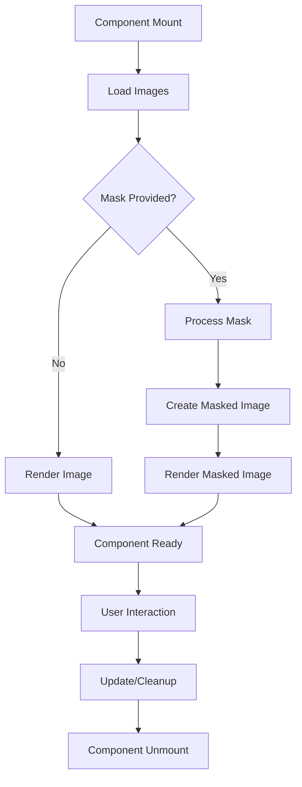

# KonvaImageWithMask Component

A high-performance React component for rendering images with advanced masking capabilities using Konva.js. This component is designed to handle complex image manipulations while maintaining optimal performance across different image sizes and browser capabilities.

## 🚀 Features

- **Advanced Masking**: Support for complex masking operations with multiple composite modes
- **Performance Optimized**: Intelligent processing based on image size and browser capabilities
- **Memory Safe**: Automatic cleanup of resources, blob URLs, and canvas contexts
- **High-DPI Ready**: Automatic device pixel ratio handling for crisp displays
- **Browser Adaptive**: Uses optimal rendering methods based on browser capabilities
- **Error Resilient**: Comprehensive error handling and graceful degradation

## 📋 Table of Contents

- [Installation](#installation)
- [Basic Usage](#basic-usage)
- [Advanced Usage](#advanced-usage)
- [Props API](#props-api)
- [Performance Guide](#performance-guide)
- [Architecture](#architecture)
- [Browser Support](#browser-support)
- [Troubleshooting](#troubleshooting)
- [Contributing](#contributing)

## 🛠️ Installation

This component is part of the TailorKit application and requires:

```bash
# Core dependencies
npm install konva react-konva react
```

## 🎯 Basic Usage

### Simple Image Rendering

```tsx
import KonvaImageWithMask from './KonvaImageWithMask.client'

function ImageCanvas() {
  return (
    <Stage width={800} height={600}>
      <Layer>
        <KonvaImageWithMask width={300} height={200} src="/path/to/image.jpg" x={100} y={50} />
      </Layer>
    </Stage>
  )
}
```

### Image with Mask

```tsx
function MaskedImageCanvas() {
  return (
    <Stage width={800} height={600}>
      <Layer>
        <KonvaImageWithMask
          width={300}
          height={200}
          src="/path/to/image.jpg"
          mask={{
            src: '/path/to/mask.png',
            invert: false,
            globalCompositeOperation: 'destination-in',
          }}
          x={100}
          y={50}
        />
      </Layer>
    </Stage>
  )
}
```

## 🔧 Advanced Usage

### With Ref and Dynamic Properties

```tsx
function AdvancedImageCanvas() {
  const imageRef = useRef<Konva.Image>(null)
  const [maskInverted, setMaskInverted] = useState(false)

  const handleImageClick = () => {
    setMaskInverted(!maskInverted)
  }

  return (
    <Stage width={800} height={600}>
      <Layer>
        <KonvaImageWithMask
          spriteRef={imageRef}
          width={300}
          height={200}
          src="/path/to/image.jpg"
          mask={{
            src: '/path/to/mask.png',
            invert: maskInverted,
            globalCompositeOperation: 'destination-in',
          }}
          rotation={45}
          visible={true}
          onClick={handleImageClick}
          x={100}
          y={50}
        />
      </Layer>
    </Stage>
  )
}
```

### Performance Optimized for Large Images

```tsx
function LargeImageCanvas() {
  return (
    <Stage width={800} height={600}>
      <Layer>
        <KonvaImageWithMask
          width={1920}
          height={1080}
          src="/path/to/large-image.jpg"
          mask={{
            src: '/path/to/mask.png',
            invert: false,
            globalCompositeOperation: 'destination-in',
          }}
          // Component automatically optimizes for large images
          x={0}
          y={0}
        />
      </Layer>
    </Stage>
  )
}
```

## 📚 Props API

### Core Props

| Prop        | Type                     | Required | Default | Description                   |
| ----------- | ------------------------ | -------- | ------- | ----------------------------- |
| `width`     | `number`                 | ✅       | -       | Width of the image in pixels  |
| `height`    | `number`                 | ✅       | -       | Height of the image in pixels |
| `src`       | `string`                 | ❌       | -       | Path to the source image      |
| `mask`      | `IMaskConfig`            | ❌       | -       | Mask configuration object     |
| `spriteRef` | `RefObject<Konva.Image>` | ❌       | -       | Reference to Konva Image node |

### Inherited Props

The component inherits all standard Konva node properties:

- `x`, `y` - Position coordinates
- `rotation` - Rotation angle in degrees
- `scale` - Scale factor
- `visible` - Visibility state
- `opacity` - Opacity value (0-1)
- `draggable` - Enable/disable dragging
- And all other Konva NodeConfig properties

### Mask Configuration (`IMaskConfig`)

```typescript
interface IMaskConfig {
  src: string
  invert?: boolean
  globalCompositeOperation?: 'destination-in' | 'source-in' | 'destination-out' | 'source-out'
}
```

#### Composite Operations

| Operation         | Description                                             | Use Case         |
| ----------------- | ------------------------------------------------------- | ---------------- |
| `destination-in`  | Keep image pixels where mask is opaque                  | Standard masking |
| `source-in`       | Similar to destination-in with different alpha handling | Advanced masking |
| `destination-out` | Remove image pixels where mask is opaque                | Cutout effects   |
| `source-out`      | Remove image pixels where mask is transparent           | Inverse cutout   |

## ⚡ Performance Guide

### Image Size Optimization

The component automatically adjusts processing based on image size:

#### Small/Medium Images (< 1MP)

- Full processing with all optimizations
- Real-time mask processing
- High-quality smoothing and blur effects

#### Large Images (1MP - 20MP)

- Optimized processing with selective features
- Debounced operations to prevent UI blocking
- Batch pixel processing for better performance

#### Very Large Images (> 20MP)

- Minimal processing to prevent browser lockup
- CSS filter fallbacks where possible
- Reduced quality settings for acceptable performance

### Performance Best Practices

1. **Image Size Management**

   ```tsx
   // Good: Appropriate size for use case
   <KonvaImageWithMask width={800} height={600} src="/optimized-image.jpg" />

   // Avoid: Unnecessarily large images
   <KonvaImageWithMask width={300} height={200} src="/4k-image.jpg" />
   ```

2. **Mask Optimization**

   ```tsx
   // Good: Simple mask with clear boundaries
   mask={{ src: "/simple-mask.png", invert: false }}

   // Avoid: Complex masks with gradients for large images
   mask={{ src: "/complex-gradient-mask.png", invert: true }}
   ```

3. **Memory Management**
   ```tsx
   // The component handles cleanup automatically
   // No manual memory management required
   ```

### Memory Usage

The component implements several memory optimization strategies:

- **Canvas Reuse**: Off-screen canvases are reused to minimize allocation
- **Blob URL Management**: Automatic cleanup of blob URLs prevents memory leaks
- **Abort Controllers**: Pending operations are cancelled on unmount
- **Resource Cleanup**: Comprehensive cleanup of all resources

## 🏗️ Architecture

### Component Flow



### Key Optimizations

1. **Browser Capability Detection**
   - Detects CSS filter support
   - Identifies imageSmoothingQuality support
   - Caches results for reuse

2. **Canvas Management**
   - Reuses off-screen canvases
   - Manages high-DPI scaling
   - Optimizes canvas dimensions

3. **Memory Management**
   - Automatic blob URL cleanup
   - Resource disposal on unmount
   - Cancellation of pending operations

4. **Performance Scaling**
   - Dynamic processing based on image size
   - Batch processing for large images
   - Debounced operations for UI responsiveness

## 🌐 Browser Support

### Supported Browsers

- ✅ Chrome 60+
- ✅ Firefox 55+
- ✅ Safari 12+
- ✅ Edge 79+

### Feature Detection

The component automatically detects and uses:

- **CSS Filters**: For optimized blur operations
- **ImageSmoothingQuality**: For better image rendering
- **Device Pixel Ratio**: For high-DPI displays
- **Canvas API**: For image manipulation

### Fallbacks

- CSS filter fallback to canvas-based blur
- ImageSmoothingQuality fallback to basic smoothing
- High-DPI fallback to standard resolution

## 🔍 Troubleshooting

### Common Issues

#### Images Not Loading

**Symptoms**: Component renders but no image appears

**Solutions**:

1. Check image path and accessibility
2. Verify CORS settings for cross-origin images
3. Ensure image format is supported (JPEG, PNG, WebP, etc.)

```tsx
// Good: Proper CORS handling
<KonvaImageWithMask src="https://example.com/image.jpg" />

// Check: Verify image loads in browser
// Network tab should show successful image loading
```

#### Performance Issues

**Symptoms**: Slow rendering, UI blocking, high memory usage

**Solutions**:

1. Reduce image dimensions
2. Optimize image file size
3. Disable smoothing for very large images
4. Use appropriate composite operations

```tsx
// For large images, component automatically optimizes
// Monitor performance in DevTools
```

#### Mask Not Applying

**Symptoms**: Mask image loads but masking effect doesn't appear

**Solutions**:

1. Verify mask image format (PNG with transparency recommended)
2. Check composite operation setting
3. Ensure mask dimensions match image dimensions
4. Verify mask image loads successfully

```tsx
// Good: Clear mask configuration
mask={{
  src: "/mask.png",
  invert: false,
  globalCompositeOperation: "destination-in"
}}
```

### Debug Options

#### Console Logging

The component provides helpful console warnings and errors:

```javascript
// Enable verbose logging (development only)
// Check browser console for warnings and errors
```

#### Performance Monitoring

```javascript
// Monitor memory usage
// Chrome DevTools > Performance > Memory
// Look for memory leaks or excessive allocations
```

#### Network Monitoring

```javascript
// Monitor image loading
// Chrome DevTools > Network > Img
// Verify all images load successfully
```

## 🤝 Contributing

### Development Setup

1. Clone the repository
2. Install dependencies: `npm install`
3. Start development server: `npm run dev`

### Code Style

- Follow existing TypeScript patterns
- Add JSDoc comments for new functions
- Include performance considerations in comments
- Test with various image sizes and formats

### Testing

- Test with small, medium, and large images
- Verify memory cleanup on unmount
- Test browser compatibility
- Validate mask operations

### Performance Testing

- Measure render times for different image sizes
- Monitor memory usage during operations
- Test with various mask configurations
- Validate optimization thresholds

## 📄 License

This component is part of the TailorKit application and follows the project's licensing terms.

## 🔗 Related

- [Konva.js Documentation](https://konvajs.org/docs/index.html)
- [React Konva Documentation](https://github.com/konvajs/react-konva)
- [Canvas API Documentation](https://developer.mozilla.org/en-US/docs/Web/API/Canvas_API)

---

**Note**: This component is optimized for production use and handles edge cases automatically. For custom implementations or modifications, please refer to the detailed JSDoc comments in the source code.
